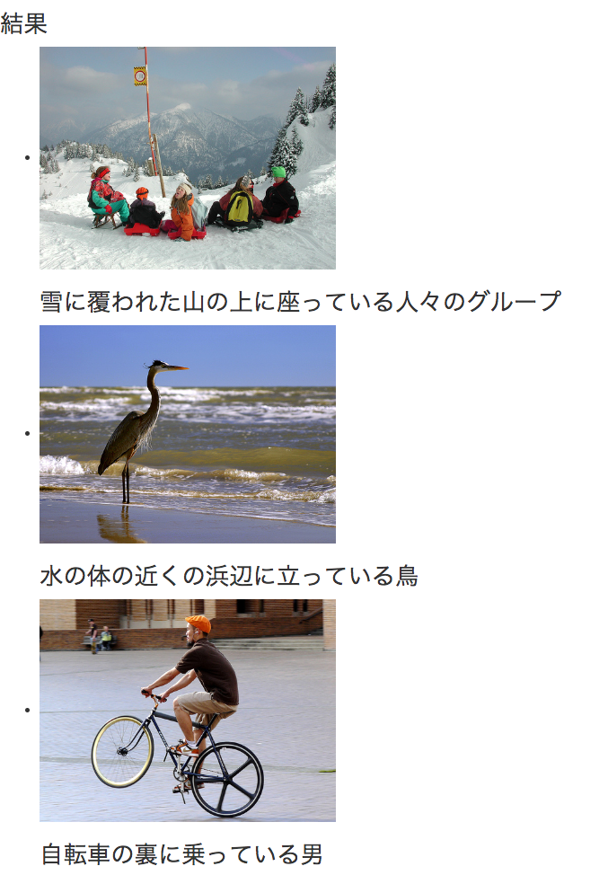

# Azure Vision AIを遊んでみた

## 背景

AzureはAIの機能強化をどんどんしている。

中に面白そうなのをピックアップして試した。

## こんな感じ



[動くデモ](https://image-caption.herokuapp.com/)

## 実現の仕方

* Azureのフリーアカウントを作成
* Vision APIのキーを発行
* pythonで画像をVision APIにポスト
* 現状の結果が英語だけなので、Translation APIで日本語をゲット

## LTまとめ

* 汎用的なAIは結構API化されて、開発者なら誰でも使える
  * 自分のノートパソコンで訓練しようとしたら、１週間強かかる。。
* 独自なニーズのAIは、自分で訓練するしかない

## ソースコード

### 起動の仕方

```shell
$ cd ./azure_image_caption/webapp

$ export AZURE_VISION_API_KEY=<your api key>

$ export AZURE_TRANSLATION_API_KEY=<your api key>

$ python3 web.py

$ open http://localhost:5000

```

## Dockerで動かす

```shell
$ docker build -t image_caption .

# your key set in .env file
$ docker run -d -p 5000:5000 --name=image_caption --env-file .env image_caption
$ open http://localhost:5000
```

## 参考

* [1] <https://docs.microsoft.com/en-us/azure/cognitive-services/Computer-vision/Quickstarts/python-analyze>

## License

MIT
